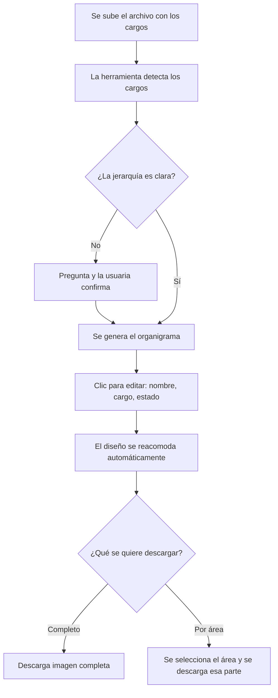

# PRD: Generador de Organigramas Interactivo

## 1. Resumen ejecutivo
Herramienta personal para crear organigramas de forma rápida: subes un archivo con los cargos de una empresa, confirmas tú la jerarquía (quién reporta a quién), y la herramienta genera un organigrama visual y editable. Puedes hacer clic en cualquier cargo para editar el nombre, el título o marcarlo como vacante (activa o inactiva), y descargar el resultado como imagen — completo o solo de un área específica.

## 2. Problema y oportunidad
Hoy los organigramas se arman manualmente en PowerPoint o Word, cuadro por cuadro. Esto es lento, y cada vez que hay un cambio de personal (alguien nuevo, alguien que se va) hay que editar manualmente y reacomodar todo. La oportunidad es automatizar ese trabajo repetitivo para pasar de horas a minutos.

## 3. Usuario objetivo
La misma persona que construye la herramienta, en dos escenarios:
- **Uso interno:** para su propia empresa.
- **Uso como servicio:** para distintos clientes/empresas a las que les arma organigramas.

No hay otros usuarios simultáneos ni edición compartida — es una herramienta de uso individual, no colaborativa.

## 4. Propuesta de valor
Pasar de armar un organigrama manualmente en horas (en PowerPoint) a generarlo y actualizarlo en minutos, sin necesitar diseño ni herramientas complejas — subes datos, confirmas jerarquía, y obtienes un organigrama profesional listo para descargar.

## 5. Casos de uso principales

**Caso 1 — Crear un organigrama nuevo**
- **Actor:** la usuaria
- **Disparador:** tiene la lista de cargos de una empresa (propia o de un cliente) y quiere visualizarla
- **Pasos:** sube el archivo → la herramienta detecta los cargos → pregunta por las relaciones de jerarquía que no estén claras → la usuaria confirma cada una → se genera el organigrama
- **Resultado:** organigrama visual completo, con niveles bien ordenados

**Caso 2 — Editar un cargo existente**
- **Actor:** la usuaria
- **Disparador:** alguien cambió de cargo, se fue, o entra alguien nuevo
- **Pasos:** hace clic en la caja del cargo → edita nombre, título o estado (vacante activa/inactiva) → guarda el cambio
- **Resultado:** el organigrama se actualiza y reacomoda automáticamente

**Caso 3 — Descargar el organigrama**
- **Actor:** la usuaria
- **Disparador:** necesita enviar o presentar el organigrama
- **Pasos:** elige "descargar completo" o "descargar por área" → selecciona el área si aplica → se genera la imagen
- **Resultado:** archivo de imagen listo para compartir

## 6. Recorrido del usuario

**Camino feliz:**
1. Abre la herramienta.
2. Sube un archivo con la lista de cargos.
3. La herramienta muestra los cargos detectados y pide confirmar (o corregir) la jerarquía cuando no esté clara.
4. Se genera el organigrama con un diseño ordenado por niveles.
5. Hace clic en cualquier caja para editar nombre, cargo o estado de vacante.
6. Descarga el resultado, completo o por área.

**Cuando algo falla o la IA no puede resolver:**
- Si el archivo no se puede leer (formato dañado, vacío, etc.), se muestra un mensaje claro: *"No pude leer este archivo. Revisa que tenga el formato correcto e inténtalo de nuevo."*
- Si hay una relación de jerarquía ambigua (ej. dos cargos con el mismo nombre), la herramienta **nunca asume**: pregunta explícitamente antes de continuar.
- Si la usuaria intenta descargar sin haber confirmado toda la jerarquía, se le avisa qué falta antes de generar la imagen.

## 7. Qué hace la IA (Claude) — en simple

- **Qué recibe:** el archivo con la lista de cargos, y las confirmaciones de jerarquía que la usuaria va dando.
- **Qué produce:** la estructura del organigrama ya ordenada (niveles, líneas de reporte) y el diseño visual (cajas, alineación, estética profesional), lista para mostrarse y descargarse como imagen.
- **Qué NO debe hacer nunca:**
  - No debe asumir o inventar una relación de "quién reporta a quién" sin confirmación explícita de la usuaria.
  - No debe manejar ni pedir datos sensibles (salarios, fotos, datos personales) — solo cargo, nombre y estado de vacante.

## 8. Construibilidad con Claude

**Se construye completamente con Claude:**
- La lógica para leer el archivo subido y detectar los cargos.
- El proceso de preguntar y confirmar la jerarquía con la usuaria.
- El armado visual del organigrama (niveles, líneas, alineación, estética).
- La interfaz donde se ve, se hace clic y se edita cada cargo.
- La generación de la imagen descargable (completa o por área).

**Requiere conocimiento adicional (aunque no para esta v1):**
- Ninguna conexión externa (pagos, bases de datos externas, APIs de terceros) es necesaria para el alcance actual. Todo el producto vive dentro de una sola aplicación autocontenida.
- Si en el futuro se decide que otras personas usen la herramienta al mismo tiempo (colaboración en línea) o que se guarden automáticamente decenas de organigramas de forma permanente y segura en la nube, ahí sí se necesitaría *"almacenamiento en la nube"* (un lugar donde se guarda información de forma permanente incluso si se cierra el navegador) — eso requeriría conocimiento de desarrollo backend, pero no es parte del alcance actual ni de la Fase 2 definida.

**Buena noticia:** al ser una herramienta de uso personal, sin pagos ni datos sensibles ni multiusuario, este proyecto se mantiene 100% dentro de lo que se construye conversando con Claude, sin depender de servicios externos ni de otro perfil técnico.

## 9. Alcance del MVP

| Prioridad | Funcionalidad | Esfuerzo |
|---|---|---|
| **Must (v1 – 2 días)** | Subir archivo con lista de cargos | Rápido |
| **Must (v1 – 2 días)** | Confirmar/corregir jerarquía manualmente (sin asunciones automáticas) | Medio |
| **Must (v1 – 2 días)** | Generar organigrama visual con 1 estilo de diseño (niveles, líneas, alineación) | Medio |
| **Must (v1 – 2 días)** | Editar por clic: nombre, cargo, estado (vacante activa/inactiva) | Medio |
| **Must (v1 – 2 días)** | Reacomodo automático del diseño tras cada edición | Medio |
| **Must (v1 – 2 días)** | Descargar organigrama completo en imagen | Rápido |
| **Must (v1 – 2 días)** | Descargar organigrama de un área específica en imagen | Medio |
| **Should (Fase 2)** | 2-3 estilos de diseño para elegir | Medio |
| **Should (Fase 2)** | Descarga en PDF | Rápido |
| **Should (Fase 2)** | Guardar y alternar entre varios organigramas de distintas empresas, cada uno con su logo | Grande |
| **Could (futuro, sin definir)** | Campos adicionales por cargo (foto, correo, área, antigüedad) | Medio |
| **Could (futuro, sin definir)** | Personalización libre de colores/tipografía/forma | Grande |
| **No por ahora** | Colaboración en línea (varias personas editando a la vez) | — |
| **No por ahora** | Datos sensibles (salarios, información personal) | — |

## 10. Cómo se construye, en simple

Piensa en la herramienta como tres partes que trabajan juntas:

1. **La pantalla (lo que se ve y con lo que se interactúa):** donde se sube el archivo, se ve el organigrama, se hace clic para editar y se presiona "descargar".
2. **El cerebro (la lógica):** interpreta el archivo subido, organiza los cargos en niveles, aplica las reglas de diseño (alineación, líneas, jerarquía visual), y sabe qué hacer cuando se edita algo.
3. **La memoria temporal:** mientras se trabaja, la herramienta recuerda el organigrama que se está armando (para poder editarlo y verlo actualizado al instante). Como es de uso personal y no se necesita guardarlo permanentemente en esta v1, no se necesita una "bodega de datos" externa (una base de datos) — todo vive en la sesión de trabajo.

## 11. Métricas de éxito

- **Métrica estrella:** armar un organigrama completo (desde subir el archivo hasta tener el diseño final) en **menos de 1 hora**.
- **Métricas de apoyo:**
  - Poder armar varios organigramas distintos en una sesión de **2 horas**.
  - Cero organigramas con jerarquías incorrectas por asunciones automáticas de la IA (meta: 100% de las relaciones confirmadas manualmente).

**Meta a 90 días:** cumplir consistentemente ambas métricas de tiempo en el uso real (propio y con clientes).
**Línea base:** hoy, armar un organigrama en PowerPoint toma "horas" (sin cifra exacta) — TBD si se quiere precisar con un caso real antes de comparar.

## 12. Riesgos y cómo evitarlos

| Riesgo | Probabilidad | Qué hacer |
|---|---|---|
| El plazo de 2 días resulta insuficiente por la complejidad de "descarga por área" | Media | Si se atrasa, se prioriza primero que la descarga completa funcione bien, y "por área" pasa a un ajuste rápido posterior |
| El archivo subido tiene un formato inesperado y la herramienta no logra leerlo | Media | Mensaje de error claro + definir de antemano 1-2 formatos de archivo soportados (ej. Excel/CSV) |
| Confusión de jerarquía en empresas con cargos de nombres repetidos | Media | La herramienta nunca asume: siempre pregunta y espera confirmación explícita |
| Con el tiempo se pierde el organigrama por no tener guardado permanente (v1 no tiene esta función) | Alta | Se recomienda descargar el resultado apenas esté listo; se resuelve de raíz en Fase 2 |

## 13. Plan 30 / 60 / 90 días

**Ahora (día 1-2) — MVP:**
- Día 1: definir con Claude el formato de archivo a usar (ej. Excel simple con columna de cargo), construir la lógica de lectura del archivo, el flujo de confirmación de jerarquía, y el primer diseño visual del organigrama.
- Día 2: construir la edición por clic (nombre, cargo, estado de vacante), el reacomodo automático, y las dos formas de descarga (completa y por área). Probar con un caso real propio.

**30 días — Uso real y ajustes:**
- Usar la herramienta en 2-3 casos reales (empresa propia + al menos un cliente).
- Anotar qué se siente lento, confuso o incompleto.
- Ajustar con Claude lo que no funcione bien en la práctica.

**60-90 días — Fase 2:**
- Agregar los 2-3 estilos de diseño.
- Agregar descarga en PDF.
- Agregar guardado y alternancia entre varios organigramas con su logo correspondiente.
- Revisar si conviene agregar campos adicionales (foto, correo, área) según lo que se necesite en el uso real.

---

## Pendientes (TBD) a resolver en la construcción
1. **Formato de archivo exacto** para la carga inicial (Excel, CSV o texto plano) — se define en el primer paso con Claude.
2. **Línea base de tiempo actual** en PowerPoint, si se quiere precisar con un caso real antes de medir la mejora.
3. **Persistencia entre sesiones:** confirmar en Fase 2 si se necesita que el organigrama quede guardado automáticamente al cerrar la herramienta, o si basta con descargarlo y volver a subir el archivo la próxima vez.

---

## Primeros pasos con Claude
1. **Prepara un archivo de prueba:** una lista simple de 8-10 cargos de una empresa real o inventada (ej. en Excel), para tener algo con qué probar de inmediato.
2. **Comparte este PRD con Claude** al iniciar la construcción, y pide explícitamente: *"Construyamos primero el Must de la sección 9 (Alcance del MVP), empezando por la carga del archivo y la confirmación de jerarquía."*
3. **Define el formato de archivo** (TBD #1) como primera decisión técnica junto con Claude, antes de escribir cualquier otra parte.
4. **Prueba cada parte apenas esté lista** (no esperes a que todo esté terminado): sube tu archivo de prueba, confirma jerarquía, edita un cargo, descarga una imagen — así detectas ajustes temprano.
5. **Al cerrar la v1, guarda este PRD** (especialmente la sección de Fase 2) para retomarlo más adelante sin tener que explicar la idea desde cero otra vez.

