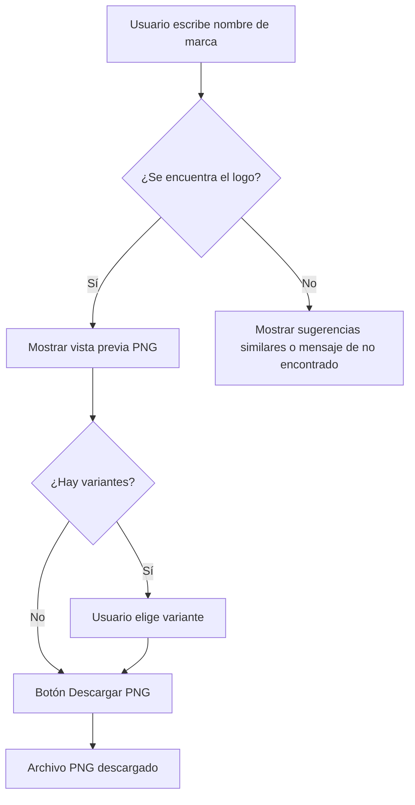

# PRD: Buscador de Logos de Marcas (PNG)

2026-09-18 · @Someone

## 1. Resumen y objetivo

Desarrollar un artefacto (herramienta web) que permita a un usuario **buscar el logo de una marca o empresa por nombre** y **descargarlo en formato PNG** de manera inmediata, sin recurrir a búsquedas manuales en buscadores de imágenes o sitios de terceros con licencias poco claras.

**Objetivo del producto:** reducir a menos de 10 segundos el tiempo que le toma a un usuario obtener el logo PNG de una marca, con buena calidad, fondo transparente cuando sea posible, y trazabilidad de la fuente.

## 2. Problema y contexto

Hoy, cuando alguien necesita el logo de una marca (para una presentación, un documento, un mockup, un sitio web comparativo, etc.), suele:

- Buscar en Google Imágenes y descargar versiones de baja calidad, con fondo blanco o con marcas de agua.
- Entrar al sitio oficial de la marca y buscar en su sección de prensa/marca, si existe.
- Recurrir a bancos de logos de terceros (por ejemplo, sitios de "brand assets") cuya cobertura, calidad y legalidad de uso son inconsistentes.

Esto genera fricción, resultados de baja calidad y riesgo de usar activos sin los derechos adecuados. Un artefacto dedicado que centralice la búsqueda y entrega el archivo PNG correcto resuelve ese problema de forma rápida y consistente.

## 3. Usuarios objetivo y casos de uso

| Usuario | Caso de uso principal |
| --- | --- |
| Diseñador/a UX-UI | Necesita el logo de una marca para incluirlo en un mockup o wireframe |
| Marketing / Growth | Arma presentaciones, landing pages o material comparativo con logos de partners o competidores |
| Desarrollador/a | Integra el logo de un cliente o proveedor en una web, app o email transaccional |
| Ventas / Éxito de cliente | Prepara propuestas o decks personalizados con el logo del prospecto o cliente |
| Equipo de contenido | Ilustra artículos, comparativas o reportes que mencionan marcas |

**Caso de uso central:** el usuario escribe el nombre de una marca (ej. "Spotify"), el sistema muestra el logo (o variantes: isotipo, logotipo, versión clara/oscura) y el usuario descarga el PNG con un clic.

## 4. Alcance (funcionalidades incluidas)

**MVP (Fase 1):**

- Campo de búsqueda por nombre de marca/empresa.
- Resultado con el logo principal en PNG, con vista previa antes de descargar.
- Botón de descarga directa del archivo PNG.
- Manejo de "no encontrado" con sugerencia de nombres similares.

**Fase 2 (mejoras):**

- Selección entre variantes del logo (isotipo, logotipo completo, versión clara/oscura, color/monocromo).
- Selección de tamaño/resolución de salida.
- Historial de búsquedas recientes del usuario.
- Descarga en lote (varias marcas a la vez, ej. para un slide de "partners").

**Fase 3 (opcional / futuro):**

- Soporte adicional de formatos (SVG, WebP) reutilizando la misma búsqueda.
- API pública para integrarlo en otras herramientas internas.

## 5. Requisitos funcionales

| ID | Requisito | Prioridad |
| --- | --- | --- |
| RF-01 | El sistema debe permitir ingresar el nombre de una marca en un campo de texto con autocompletado | Alta |
| RF-02 | El sistema debe mostrar una vista previa del logo antes de la descarga | Alta |
| RF-03 | El sistema debe permitir descargar el logo en formato PNG con un solo clic | Alta |
| RF-04 | El sistema debe indicar cuando no se encuentra el logo solicitado y sugerir alternativas | Alta |
| RF-05 | El sistema debe mostrar el fondo transparente cuando la fuente lo permita | Media |
| RF-06 | El sistema debe permitir elegir entre variantes de logo cuando existan (isotipo/logotipo, claro/oscuro) | Media |
| RF-07 | El sistema debe registrar la fuente/origen del logo mostrado | Media |
| RF-08 | El sistema debe permitir seleccionar resolución de salida (ej. 256px, 512px, 1024px) | Baja |
| RF-09 | El sistema debe soportar búsquedas en español e inglés | Media |

## 6. Requisitos no funcionales

- **Rendimiento:** tiempo de respuesta de búsqueda menor a 2 segundos; descarga inmediata sin pasos intermedios.
- **Disponibilidad:** el servicio debe estar disponible al menos el 99% del tiempo si depende de una API externa.
- **Calidad de imagen:** los PNG entregados deben tener al menos 256x256 px, idealmente con fondo transparente.
- **Escalabilidad:** debe soportar picos de uso (ej. lanzamientos, campañas) sin degradar el rendimiento.
- **Seguridad:** no almacenar datos personales; si se cachean logos, hacerlo respetando términos de uso de la fuente.
- **Compatibilidad:** funcional en navegadores modernos de escritorio y móvil.

## 7. Flujo de usuario

El flujo prioriza que, en el caso más común (marca conocida, un solo logo), el usuario llegue a la descarga en máximo dos pasos: buscar y descargar.

## 8. Consideraciones técnicas

**Fuente de los logos.** El equipo de ingeniería debe evaluar y elegir una de estas opciones (no excluyentes):

| Opción | Descripción | Consideración |
| --- | --- | --- |
| API de logos de terceros (ej. Brandfetch, Clearbit Logo API, Logo.dev) | Servicio que devuelve el logo a partir del dominio o nombre de la marca | Revisar límites de uso, costos y licencia de redistribución |
| Extracción por dominio (favicon/og:image de alta resolución) | Se infiere el sitio oficial de la marca y se extrae su logo | Calidad variable, requiere lógica de resolución de nombre → dominio |
| Base de datos propia curada | El equipo sube y mantiene manualmente los logos más solicitados | Alta calidad y control, pero no escala a marcas poco comunes |
| Combinación (fallback en cadena) | Primero base propia → luego API externa → luego extracción por dominio | Recomendado para balancear calidad y cobertura |

**Procesamiento de imagen:** conversión a PNG, normalización de tamaño, y opcionalmente remoción de fondo cuando la fuente no entregue transparencia.

**Caché:** almacenar en caché los logos ya resueltos para reducir llamadas a APIs externas y mejorar tiempos de respuesta.

## 9. Consideraciones legales y de marca

Los logos son propiedad intelectual de cada marca. El producto debe:

- Mostrar un aviso claro de que los logos pertenecen a sus respectivos dueños y su uso está sujeto a las políticas de marca de cada empresa.
- Evitar presentar el servicio como un banco de "logos libres de uso"; el usuario final es responsable del uso que le dé al archivo.
- Priorizar fuentes (APIs o bases propias) que respeten los términos de uso y licenciamiento de cada proveedor.
- Incluir, cuando sea posible, un enlace a las directrices de marca oficiales de la empresa consultada.

## 10. Métricas de éxito

| Métrica | Objetivo |
| --- | --- |
| Tasa de éxito de búsqueda (logo encontrado / total de búsquedas) | ≥ 90% |
| Tiempo promedio hasta la descarga | < 10 segundos |
| Tasa de descarga tras encontrar el logo | ≥ 70% |
| Búsquedas sin resultado por semana | Tendencia a la baja |
| Satisfacción del usuario (encuesta simple, 1-5) | ≥ 4.2 |

## 11. Fuera de alcance (v1)

- Edición del logo (recorte, cambio de color, composición) dentro de la herramienta.
- Generación de logos nuevos con IA.
- Gestión de derechos de uso o licenciamiento comercial de marcas.
- Soporte para formatos vectoriales (SVG, EPS) — queda para una fase futura.
- Integración con herramientas de diseño (Figma, Canva) en el MVP.

## 12. Fases y cronograma sugerido

| Fase | Contenido | Duración estimada |
| --- | --- | --- |
| Descubrimiento | Evaluar proveedores de logos (APIs, bases de datos), validar cobertura y costos | 1 semana |
| MVP | Búsqueda por nombre + vista previa + descarga PNG (RF-01 a RF-04) | 2-3 semanas |
| Fase 2 | Variantes de logo, resolución configurable, historial | 2 semanas |
| Fase 3 | Descarga en lote, formatos adicionales, API pública | A definir según demanda |

*Nota: las duraciones son estimaciones iniciales sujetas a la complejidad real de integración con la fuente de logos elegida.*
